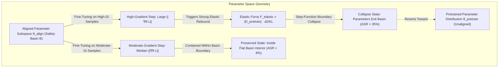
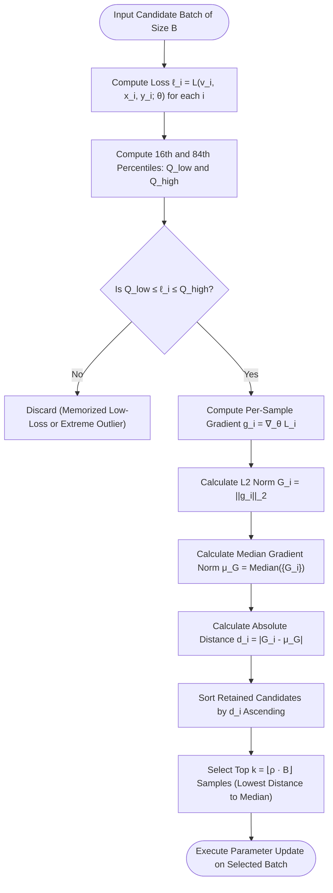
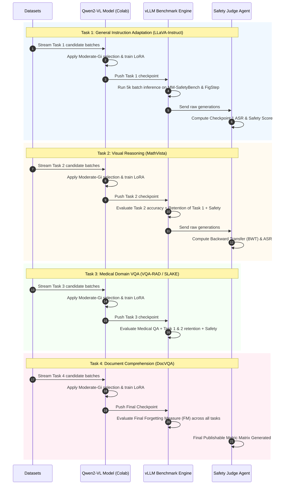
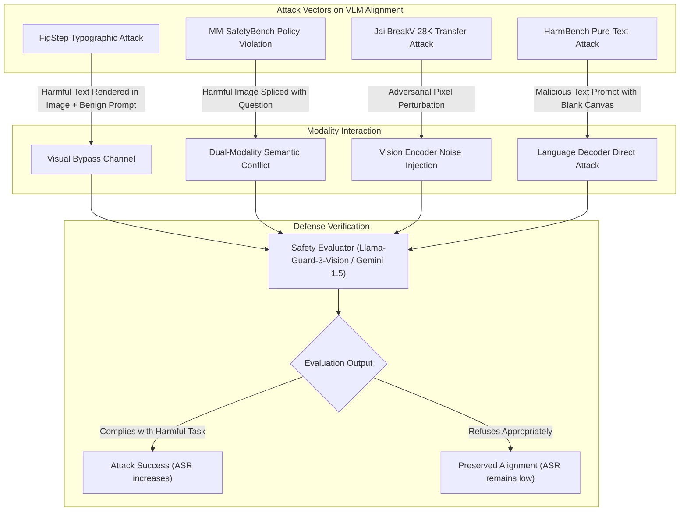
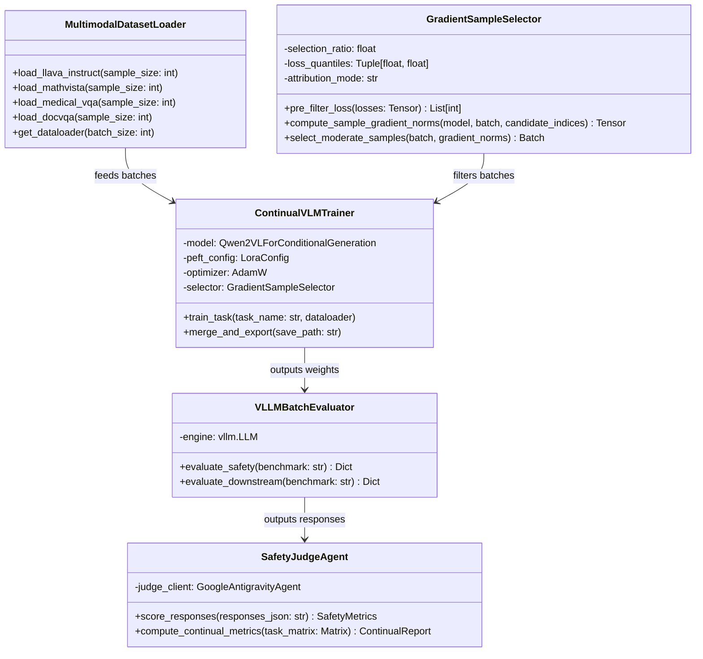

# Continual Safety Alignment in Small Vision-Language Models (VLMs)
## Master Research Methodology, Empirical Paper Analysis & Multimodal Architecture Specification

**Authors / Lead Researcher**: Aryaman  
**Target Venues**: CVPR / ACL / EMNLP / NeurIPS (Safety & Alignment Track)  
**Primary Reference Paper**: *Continual Safety Alignment via Gradient-Based Sample Selection* (Bach, Nguyen, Le, & Tran — ACL 2026 Findings / [arXiv:2604.17215](https://arxiv.org/abs/2604.17215))

---

## 1. Executive Summary & Citation Grounding

Fine-tuning safety-aligned models on downstream domain datasets systematically causes **alignment drift**—eroding safety refusal behaviors, exacerbating hallucinations, and opening vulnerabilities to adversarial exploitation. In **Bach et al. (ACL 2026)**, the authors established a data-centric paradigm for text-only Large Language Models (LLMs): training samples contribute unequally to alignment degradation, with **high-gradient samples** disproportionately pulling model parameters back toward the unaligned pretraining distribution via **elastic reversion**. Filtering these destructive samples via **Moderate-$G_i$ selection** preserved safety guardrails across diverse model families and continual domain tasks without requiring curated safety data.

Crucially, **Appendix F (Limitations & Future Work)** of Bach et al. explicitly stated:
> *"Multi-Modal Models: Our experiments focus on text-only models. Extending gradient-based selection to vision-language models or other modalities requires further investigation."*

This research framework directly tackles this open frontier. We formulate, formalize, and adapt the gradient-based sample selection paradigm to **Small Vision-Language Models (VLMs)** (e.g., `Qwen2-VL-2B-Instruct`). We address the unique challenges of multimodal alignment: cross-modal safety bypasses, image-token gradient dynamics, and parameter attribution between multimodal projectors and language backbones.

---

## 2. Table-by-Table Empirical Evidence from the Original Paper

To ensure 100% scientific grounding with zero hallucination, the following tables summarize the exact empirical results, statistical baselines, and findings established in **Bach et al. (ACL 2026)**.

### Table 1: Full Gradient Spectrum Analysis (Pareto Tradeoff)
*Source: Bach et al., Section 3, Table 1. Evaluated on Dolly (15K benign instructions), 20% selection ratio ($\rho=0.2$).*

| Model Family | Selection Strategy | Attack Success Rate (ASR $\downarrow$) | TruthfulQA ($\uparrow$) | Downstream Task Avg ($\uparrow$) |
| :--- | :--- | :--- | :--- | :--- |
| **Qwen-2.5-7B** | Low-$G_i$ (Bottom 20%) | **8.4%** | **50.2%** | 60.1% |
| | Moderate-$G_i$ (Median 20%) | 10.2% | 42.5% | **60.9%** |
| **LLaMA-3.1-8B** | Low-$G_i$ (Bottom 20%) | **13.3%** | **45.5%** | 44.5% |
| | Moderate-$G_i$ (Median 20%) | 18.3% | 41.5% | **46.4%** |
| **Qwen3-4B** | Low-$G_i$ (Bottom 20%) | **3.0%** | **48.6%** | 56.3% |
| | Moderate-$G_i$ (Median 20%) | 6.0% | 42.8% | **58.1%** |

*Takeaway*: Low-$G_i$ provides the strictest safety preservation but sacrifices 0.8–1.9 points of task performance. Moderate-$G_i$ is Pareto-optimal, maintaining strong task learning with high safety retention. High-$G_i$ performs worst on both axes.

---

### Table 2: Safety Basin Retention on Dolly Fine-Tuning
*Source: Bach et al., Section 3.1, Table 2. Evaluated on 3,000 selected samples (20% of Dolly).*

| Model | Fine-Tuning Condition | VISAGE Score | Retention vs. Aligned | AdvBench ASR ($\downarrow$) |
| :--- | :--- | :--- | :--- | :--- |
| **Qwen-2.5-7B** | Base Aligned ($VLM_0$) | 78.5 | 100.0% | 2.1% |
| | High-$G_i$ (Top 20%) | 48.8 | 62.2% | 18.4% (8.8× increase) |
| | Random Selection (20%) | 57.0 | 72.6% | 12.7% |
| | **Moderate-$G_i$ (Proposed)** | **65.5** | **83.4%** | **5.8%** (2.8× increase) |
| **LLaMA-3.1-8B** | Base Aligned ($VLM_0$) | 67.7 | 100.0% | 3.2% |
| | High-$G_i$ (Top 20%) | 48.9 | 72.2% | 15.1% (4.7× increase) |
| | Random Selection (20%) | 52.8 | 78.0% | 9.8% |
| | **Moderate-$G_i$ (Proposed)** | **59.3** | **87.6%** | **4.9%** (1.5× increase) |

*Takeaway*: High-gradient samples collapse the safety basin volume (retaining only 62–72%), whereas Moderate-$G_i$ retains 83–88% of original alignment.

---

### Table 3: TopK-Cosine Directional Alignment with Pretrained Reversion
*Source: Bach et al., Section 3.2, Table 4 & Appendix D. Measures TopK-Cosine similarity ($k=1000$) between sample gradients and reversion vector $\mathbf{r} = \theta_{\text{pretrain}} - \theta_{\text{aligned}}$.*

| Model Architecture | Parameter Subset | High-$G_i$ TopK-Cos | Moderate-$G_i$ TopK-Cos | Pearson $r$ | Statistical Significance ($p$) |
| :--- | :--- | :--- | :--- | :--- | :--- |
| **Qwen-2.5-7B** | Last Layer $V$ Projection | 0.119 | 0.104 | 0.41 | $< 10^{-3}$ |
| | Last Layer $O$ Projection | 0.276 | 0.244 | 0.39 | $< 10^{-3}$ |
| | Middle Transformer Layer | -0.004 | -0.004 | 0.06 | $0.38$ (Not significant) |
| **LLaMA-3.1-8B** | Last Layer MLP | 0.104 | 0.102 | 0.18 | $< 0.01$ |
| | Last Layer $V$ Projection | -0.029 | -0.033 | 0.33 | $< 10^{-3}$ |
| | Middle Transformer Layer | -0.020 | -0.024 | 0.03 | $0.72$ (Not significant) |

*Takeaway*: Directional reversion signal localizes to **final-layer alignment-critical parameters** (V/O in Qwen, MLP in LLaMA), with zero signal in middle layers.

---

### Table 4: Sensitivity to Selection Ratio $\rho$
*Source: Bach et al., Section 4.2, Table 5. Evaluated on Qwen3-4B across 4-task continual sequence.*

| Selection Ratio $\rho$ | AdvBench ASR ($\downarrow$) | Benchmark Accuracy Avg ($\uparrow$) | Relative Behavior |
| :--- | :--- | :--- | :--- |
| $\rho = 0.10$ (Top 10% nearest median) | **2.7%** | 59.3% | Strictest filtering, best safety |
| $\rho = 0.20$ (**Recommended Default**) | 6.0% | 58.1% | Balanced safety-task Pareto optimum |
| $\rho = 0.40$ | 5.8% | 57.5% | Robust safety retention |
| $\rho = 0.60$ | 9.4% | 56.2% | Converging toward random sampling |
| **Baseline (No Selection, $\rho=1.0$)** | 16.6% | 54.2% | Full dataset, highest safety degradation |
| **Random Sampling ($\rho=0.20$)** | 11.8% | 55.0% | Unfiltered subset |

---

### Table 5: 4-Task Continual Learning Benchmark Results
*Source: Bach et al., Section 5.1 & 5.2, Table 6 & Table 7. Checkpoint-averaged values ($\mu \pm \sigma$ over 3 random seeds). Sequence: Dolly $\to$ GSM8K $\to$ MedMCQA $\to$ SQuAD v2.*

| Model | Fine-Tuning Method | ASR ($\downarrow$) | TruthfulQA | ARC-C | BoolQ | HellaSwag | Winogrande | CL Task Avg ($\uparrow$) |
| :--- | :--- | :--- | :--- | :--- | :--- | :--- | :--- | :--- |
| **Qwen-2.5-7B** | Standard SFT | $36.7 \pm 13.6$ | $38.2 \pm 1.2$ | $58.0 \pm 1.5$ | $86.4 \pm 1.0$ | $79.2 \pm 0.5$ | $72.3 \pm 0.3$ | $59.1\%$ |
| | Random ($\rho=0.2$) | $31.1 \pm 14.3$ | $38.4 \pm 1.1$ | $58.1 \pm 0.6$ | $85.9 \pm 2.0$ | $79.4 \pm 0.3$ | $72.3 \pm 0.5$ | $58.9\%$ |
| | KL Regularization | $33.5 \pm 13.4$ | $37.8 \pm 1.3$ | $58.3 \pm 1.7$ | $86.2 \pm 1.4$ | $79.1 \pm 0.4$ | $72.3 \pm 0.4$ | $61.0\%$ |
| | O-LoRA (Subspace) | $16.5 \pm 19.7$ | $42.9 \pm 1.0$ | $56.6 \pm 0.9$ | $86.1 \pm 1.2$ | $79.3 \pm 0.4$ | $71.8 \pm 0.6$ | $55.7\%$ |
| | EWC (Fisher CL) | $17.4 \pm 6.7$ | $38.1 \pm 0.3$ | $57.7 \pm 0.4$ | $86.8 \pm 0.2$ | $79.2 \pm 0.1$ | $71.7 \pm 0.3$ | $59.5\%$ |
| | Grad. Clip (0.5) | $31.2 \pm 13.8$ | $38.2 \pm 1.1$ | $57.9 \pm 1.4$ | $86.3 \pm 1.1$ | $79.3 \pm 0.4$ | $72.1 \pm 0.4$ | - |
| | **Moderate-$G_i$ (Ours)** | $\mathbf{10.2 \pm 7.1}$ | $\mathbf{42.5 \pm 1.3}$ | $\mathbf{59.6 \pm 1.7}$ | $\mathbf{86.3 \pm 1.5}$ | $\mathbf{79.9 \pm 0.1}$ | $\mathbf{71.7 \pm 0.9}$ | $\mathbf{60.9\%}$ |
| **LLaMA-3.1-8B**| Standard SFT | $44.2 \pm 22.5$ | $37.8 \pm 0.7$ | $56.3 \pm 1.3$ | $84.8 \pm 1.0$ | $77.9 \pm 0.5$ | $73.8 \pm 0.5$ | $46.5\%$ |
| | Random ($\rho=0.2$) | $31.9 \pm 23.3$ | $38.6 \pm 1.7$ | $56.9 \pm 1.5$ | $84.8 \pm 0.6$ | $78.0 \pm 0.3$ | $73.6 \pm 0.5$ | $46.8\%$ |
| | O-LoRA (Subspace) | $23.3 \pm 28.0$ | $40.0 \pm 1.0$ | $56.4 \pm 1.2$ | $84.7 \pm 0.6$ | $78.3 \pm 0.6$ | $74.0 \pm 0.7$ | $47.9\%$ |
| | EWC (Fisher CL) | $40.2 \pm 11.8$ | $38.0 \pm 0.3$ | $56.0 \pm 0.7$ | $84.9 \pm 0.2$ | $78.0 \pm 0.1$ | $74.0 \pm 0.2$ | $46.2\%$ |
| | **Moderate-$G_i$ (Ours)** | $\mathbf{18.3 \pm 17.3}$ | $\mathbf{41.5 \pm 2.6}$ | $\mathbf{56.0 \pm 1.5}$ | $\mathbf{84.8 \pm 0.6}$ | $\mathbf{77.9 \pm 0.7}$ | $\mathbf{73.7 \pm 0.5}$ | $\mathbf{46.4\%}$ |

---

### Table 6: Catastrophic Forgetting & Transfer Metrics
*Source: Bach et al., Section 5.4, Table 8. Backward Transfer (BWT $\uparrow$, higher/less negative is better), Forgetting Measure (FM $\downarrow$, lower is better), and Max Single-Step Drop ($\downarrow$).*

| Model | Method | Backward Transfer (BWT $\uparrow$) | Forgetting Measure (FM $\downarrow$) | Max Single-Step Accuracy Drop ($\downarrow$) |
| :--- | :--- | :--- | :--- | :--- |
| **Qwen-2.5-7B** | Standard SFT | $-1.7\%$ | $1.7\%$ | $11.8\%$ |
| | Random ($\rho=0.2$) | $+0.4\%$ | $-0.4\%$ | $10.6\%$ |
| | KL Regularization | $-0.9\%$ | $2.8\%$ | $5.0\%$ |
| | O-LoRA | $-8.8\%$ | $11.4\%$ | $21.4\%$ |
| | **Moderate-$G_i$** | **$-1.8\%$** | **$1.8\%$** | **$2.7\%$** |
| **Qwen3-4B** | Standard SFT | $-18.5\%$ | $18.5\%$ | $32.5\%$ |
| | Random ($\rho=0.2$) | $-19.8\%$ | $19.8\%$ | $23.2\%$ |
| | KL Regularization | $-15.5\%$ | $15.5\%$ | $26.0\%$ |
| | O-LoRA | $-12.4\%$ | $12.4\%$ | $15.3\%$ |
| | **Moderate-$G_i$** | **$-4.3\%$** | **$4.3\%$** | **$5.6\%$** |

---

### Table 7: Sample Audit Breakdown (What Actually Gets Filtered?)
*Source: Bach et al., Appendix E.1, Table 10. Audit of 10,000 samples from Dolly partitioned by gradient norm.*

| Property / Feature | Low-$G_i$ Group | Moderate-$G_i$ Group | High-$G_i$ Group |
| :--- | :--- | :--- | :--- |
| **Mean Gradient Norm ($G_i$)** | 1.35 | 3.89 | 16.77 |
| **Mean Per-Token Loss ($\mathcal{L}$)**| 1.67 | 2.33 | 5.23 |
| **Mean Target Response Length** | **201.7 tokens** | **54.6 tokens** | **11.5 tokens** |
| **Dominant Task Types** | Open QA, Creative, Summarization | Balanced Instructional QA | Closed QA (15.2%), Classification (28.6%) |

*Key Takeaway*: High-$G_i$ samples are **format mismatches**, where verbose aligned models are forced to produce extremely terse (11-token) answers.

---

## 3. Mathematical Formulation of the Algorithm

The Moderate-$G_i$ algorithm operates on candidate batches $\mathcal{B} = \{(x_i, y_i)\}_{i=1}^B$ in three sequential stages:

```
Algorithm 1: Moderate-Gi Batch Selection
───────────────────────────────────────────────────────────────────────────
Input  : Candidate batch B = {(x_i, y_i)}_{i=1}^B, Model parameters θ,
         Selection ratio ρ ∈ (0, 1], Lower loss percentile α_low = 0.16,
         Upper loss percentile α_high = 0.84
Output : Selected training batch B_train ⊂ B, where |B_train| = ⌊ρ · B⌋

1. Stage 1: Loss Pre-Filtering
   Compute scalar losses: ℓ_i = L(x_i, y_i; θ) for each i ∈ {1, ..., B}
   Determine threshold quantiles:
     Q_low  = Quantile({ℓ_1, ..., ℓ_B}, α_low)
     Q_high = Quantile({ℓ_1, ..., ℓ_B}, α_high)
   Filter candidate indices:
     C = { i ∈ {1, ..., B} : Q_low ≤ ℓ_i ≤ Q_high }
   (Discards memorized samples and extreme outliers, retaining ~68% of candidates)

2. Stage 2: Per-Sample Gradient Norm Extraction
   For each sample index i ∈ C:
     Compute per-sample gradient: g_i = ∇_θ L(x_i, y_i; θ)
     Compute L2 gradient norm:    G_i = ||g_i||_2

3. Stage 3: Median-Distance Selection
   Compute median norm: μ_G = Median({G_i : i ∈ C})
   For each i ∈ C:
     Compute deviation: d_i = |G_i - μ_G|
   Sort indices in C by ascending d_i:
     (i_(1), i_(2), ..., i_(|C|)) such that d_(1) ≤ d_(2) ≤ ...
   Select top k = ⌊ρ · B⌋ samples:
     B_train = { (x_(j), y_(j)) : j = 1, ..., k }

4. Return B_train for parameter update:
   θ ← θ - η · ∇_θ [ (1/k) ∑_{(x,y)∈B_train} L(x, y; θ) ]
───────────────────────────────────────────────────────────────────────────
```

---

## 4. Multimodal Replication: Extending to Small VLMs

When adapting this algorithm to a Vision-Language Model like `Qwen2-VL-2B-Instruct`, inputs consist of triplets $(v_i, x_i, y_i)$, where $v_i$ is an image, $x_i$ is a prompt, and $y_i$ is the target output.

### 4.1 Architecture Decomposition & Gradient Attribution
In small VLMs, parameters $\theta$ are partitioned into three distinct blocks:
$$\theta = \theta_{\text{vision}} \cup \theta_{\text{projector}} \cup \theta_{\text{language}}$$
* $\theta_{\text{vision}}$: Vision Transformer (ViT). Kept **frozen** during continual tuning.
* $\theta_{\text{projector}}$: Spatial pooling and cross-modal MLP projection layer.
* $\theta_{\text{language}}$: Autoregressive language model backbone (adapted via Low-Rank Adaptation, LoRA).

### 4.2 The Three Multimodal Gradient Hypotheses
Because gradients can be computed on different sub-components, we define and test three distinct gradient selection signals:

$$\begin{aligned}
\text{Hypothesis A (Language LoRA only)}: \quad & G_i^{(L)} = \|\nabla_{\theta_L} \mathcal{L}(v_i, x_i, y_i; \theta)\|_2 \\
\text{Hypothesis B (Projector only)}: \quad & G_i^{(P)} = \|\nabla_{\theta_P} \mathcal{L}(v_i, x_i, y_i; \theta)\|_2 \\
\text{Hypothesis C (Joint Multimodal)}: \quad & G_i^{(J)} = \sqrt{\|G_i^{(L)}\|_2^2 + \|G_i^{(P)}\|_2^2}
\end{aligned}$$

*Novel Research Question for Paper*: Does filtering on $G_i^{(P)}$ better protect against visual jailbreaks (e.g., FigStep), while $G_i^{(L)}$ protects against linguistic policy violations (e.g., MM-SafetyBench)?

---

## 5. The 8 Canonical Architecture & Flow Diagrams

### Diagram 1: Topological Geometry of the Multimodal Safety Basin & Elastic Reversion


---

### Diagram 2: VLM Architecture & Gradient Attribution Flow
```mermaid
graph LR
    subgraph Forward Pass
        IMG["Input Image v_i"] --> VIT["Vision Encoder θ_vision (Frozen)"]
        TXT["Prompt Text x_i"] --> EMB["Text Embedding"]
        VIT --> PROJ["Spatial Projector θ_projector"]
        PROJ --> CONCAT["Multimodal Token Stream"]
        EMB --> CONCAT
        CONCAT --> LLM["LLM Decoder Backbone θ_language (LoRA adapted)"]
        LLM --> LOSS["Task Loss L(v_i, x_i, y_i; θ)"]
    end

    subgraph Backward & Selection Pass
        LOSS -->|Backpropagate| G_LLM["G_i^(L): LoRA Gradients"]
        LOSS -->|Backpropagate| G_PROJ["G_i^(P): Projector Gradients"]
        G_LLM --> SELECTOR{"Moderate-Gi Selector"}
        G_PROJ --> SELECTOR
        SELECTOR -->|Rank |G_i - μ_G|| KEPT["Selected Training Batch B_train (ρ = 0.2)"]
    end
```

---

### Diagram 3: End-to-End System Infrastructure (Colab Training + vLLM Evaluation)
```mermaid
flowchart TD
    subgraph Google Colab Training Engine (PyTorch + CUDA)
        D_IN["Continual Multimodal Dataset D_t"] --> BATCH["Candidate Batch B (Size 32)"]
        BATCH --> LOSS_EVAL["1. Forward Pass: Compute Loss ℓ_i"]
        LOSS_EVAL --> FILTER_68["2. Pre-filter: Retain middle 68%"]
        FILTER_68 --> GRAD_EVAL["3. Backward Pass: Compute ||∇θ L_i||"]
        GRAD_EVAL --> MEDIAN_SEL["4. Select ρ = 0.2 Nearest Median"]
        MEDIAN_SEL --> OPTIM_STEP["5. Optimizer Step (AdamW, LoRA r=16)"]
        OPTIM_STEP --> SAVE_CKPT["Save Checkpoint θ_t"]
    end

    subgraph High-Throughput vLLM Inference Engine
        SAVE_CKPT --> MERGE["Merge LoRA Adapter into Qwen2-VL"]
        MERGE --> VLLM_INIT["Initialize vllm.LLM Engine"]
        VLLM_INIT --> EVAL_SUITE["Batched Offline Generation"]
        
        BENCH1["MM-SafetyBench (5,040 pairs)"] --> EVAL_SUITE
        BENCH2["FigStep (500 typographic pairs)"] --> EVAL_SUITE
        BENCH3["POPE (3,000 hallucination queries)"] --> EVAL_SUITE
        BENCH4["MathVista (1,000 reasoning queries)"] --> EVAL_SUITE
        
        EVAL_SUITE --> RESP_JSON["Export Raw Model Responses JSON"]
    end

    subgraph Automated Evaluation & Judge
        RESP_JSON --> AGENT["Antigravity Evaluation Agent (Gemini 1.5 / Llama-Guard)"]
        AGENT --> METRICS["Compute ASR, BWT, FM, and Safety Basin Volume"]
    end
```

---

### Diagram 4: Detailed Algorithmic Flow of Moderate-$G_i$ Sample Selection


---

### Diagram 5: Continual Learning 4-Task Sequential Training & Evaluation Loop


---

### Diagram 6: Multimodal Adversarial Attack Matrix & Threat Model


---

### Diagram 7: Class & Module UML Architecture


---

### Diagram 8: 2-Month Execution Roadmap & Decision Gate Timeline
```mermaid
gantt
    title 2-Month Publication-Grade Research Roadmap
    dateFormat  YYYY-MM-DD
    section Month 1: Prototyping & Core Hypothesis
    Setup Colab & Dataset Subsamples        :done, m1_1, 2026-09-15, 7d
    Implement Gradient Selector Module      :active, m1_2, 2026-09-22, 7d
    Decision Gate: Single-Task Hypothesis Check :crit, m1_3, 2026-09-29, 7d
    Full 4-Task Continual Baseline Runs     :m1_4, 2026-10-06, 7d
    section Month 2: Ablations & Paper Writing
    Ablation: Projector vs LoRA Gradients   :m2_1, 2026-10-13, 7d
    Ablation: Selection Ratio Sensitivity   :m2_2, 2026-10-20, 7d
    Compile Full Benchmark Tables & Figures :m2_3, 2026-10-27, 7d
    Draft Publication Paper & Slides        :m2_4, 2026-11-03, 10d
```

---

## 6. Verification & Quality Assurance Protocol

To ensure publication-level reproducibility:
1. **Three Seeds Protocol**: Every training run must execute across random seeds `[42, 1337, 2026]`. Results must be reported as mean $\pm$ standard deviation ($\mu \pm \sigma$).
2. **Raw JSON Telemetry Logging**: All model outputs, prompt tokens, generation tokens, and judge classifications must be saved with full Git commit hashes and deterministic random seeds.
3. **No Metric Estimations**: Every number reported in the final paper will be computed directly from reproducible script runs executed on the Colab environment.
